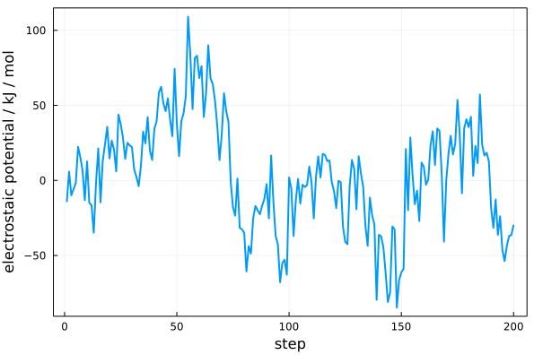

# SolvationInteractionPotential

Computes the electrostatic potential of the molecules which have at least
one atom within a distance from a solute. 

## Installation

```julia
julia> import Pkg

julia> Pkg.add(url="http://github.com/m3g/SolvationInteractionPotential.jl")
```

## Example

```julia
using Plots
using PDBTools
using SolvationInteractionPotential

# read pdb file
pdb = readPDB("./simulacao_EMIMDCA.pdb")

# solute atoms
solute = select(pdb, "protein")
solvent = select(pdb, "resname EMI")

# trajectory file (Gromacs xtc only)
trajectory = "./simulacao_EMIMDCA_curta.xtc"

# topology files
top_files = [ "./topol.top", "./tip3p.itp" ]

# distance of the first dip in the distribution
cutoff = 8.

# compute electrostatic potential
u = electrostatic_potential(
    solute,
    solvent,
    cutoff,
    trajectory, 
    top_files,
)

plot(
    u,
    xlabel="step",
    ylabel="electrostaic potential / kJ / mol",
    linewidth=2, framestyle=:box, label=nothing
)
```

Will produce:



## References


